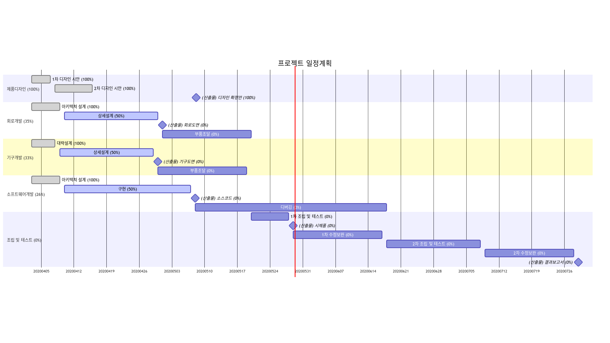

# G2M

_GanttProject로 작성한 간트챠트 데이타를 html 파일로 변환해 주는 유틸리티_

## 아이디어

* 업무상 프로젝트 관리를 하고, 간트챠트를 매일 갱신하면서 보고서를 써내야 하는 일이 너무 귀챦았음.
* MS Project 같은 상용 툴이나, 각종 이슈트래커, 구글 캘린더와 연동되는 간트챠트 생성 도구, 엑셀로 지저분하게 만들어진 프로젝트 관리 툴 같은 것들 전부 다 써봤는데 마음에 드는게 하나도 없음.
* 대부분 쓸데없이 복잡하기만 하거나, 기능이 부족하거나, 보고서의 독자들이 싫어하는 형태로만 출력해 주는 것들 뿐임.
* 그나마 오픈소스 GanttProject 프로그램이 간단함+필수기능 전부 갖추고 있는 것으로 판단.  또 윈도우,리눅스 어디서든 설치 가능한 자바 어플 형태였음.
* 그런데 딱 하나 불만족스러운게, 간트챠트를 마은에 드는 예쁜 그림으로 만들어주지 못함.  기본으로 정해져 있는 디자인이 너무 마음에 안 들음.
* 그냥 데이타는 GanttProject로 관리하고, 보고서용 간트챠트 그림은 g2m 스크립트로 좀 정돈시켜서 뽑아내자는 뭐 그런 아이디어가 전부임.

## 전제조건

* 구글 크롬 브라우저를 깔아두어야 합니다. (`gantt.png` 그림파일 생성용)
* [GanttProject 프로그램](https://www.ganttproject.biz/)을 깔아서 프로젝트 관리를 합니다. (`gantt.csv` 데이타 파일 생성용)  또 한글 상태로 g2m 스크립트를 맞추어 두었기 때문에 한글 모드로 운용해야 합니다.
* `gantt.html` 파일을 브라우저로 열어보려면 반드시 외부 인터넷에 연결되어 있어야 합니다. (클라우드플래어에 Mermaid.js와 연결해 두었기 때문)

## GanttProject로 간트챠트 작성시 유의사항

* GanttProject 프로그램의 설정(`메뉴 프로젝트 - 수정 - 설정`)에서, `챠트 - 사용자 지정 간단한 날짜 형식`은 `yyyy-MM-dd`로 써넣어 주고, `CSV 형식으로 내보내기`는 가능한 모든 항목을 전부 다 체크해 주면 문제가 없습니다.
* Ganttproject 프로그램을 사용하고 싶지 않다면, 그냥 엑셀로 `ID, 이름, 시작일, 종료일, 완료` 이름으로 항목을 만들어 작성해 주셔도 됩니다.  이때 이름은, 아래의 태스크들을 포함하는 섹션 이름의 경우에는 그냥 써 주시면 되고, 각각의 태스크들은 앞에 빈문자(Space)를 2개 넣어 주고 이름을 써 넣으면 됩니다.  시작일,종료일은 `2018-12-01` 형식으로 날짜를 써 주면 됩니다.  완료 항목은, 아직 시작하지 않은 경우에는 0, 완료한 경우에는 100으로 해 주시고 현재 진행중이라면 그 사이의 숫자(50)를 넣어주시면 됩니다.

## 사용방법 (MS윈도우)

* [GanttProject 프로그램](https://www.ganttproject.biz/)으로 데이타(`gantt.gan`)를 편집후 저장합니다.
* `g2m.bat` 파일을 더블클릭해서 실행합니다.
* 그러면 `gantt.csv`, `gantt.html`, `gantt_mermaid.png`, `gantt.png` 파일이 생성됩니다.

## 사용방법 (리눅스)

* [GanttProject 프로그램](https://www.ganttproject.biz/)으로 데이타(`gantt.gan`)를 편집후 저장합니다.
* `g2m.sh` 파일을 더블클릭해서 실행합니다.
* 그러면 `gantt.csv`, `gantt.html`, `gantt_mermaid.png`, `gantt.png` 파일이 생성됩니다.

## MS윈도우용 실행파일(`g2m.exe`)를 빌드한 조건

* 윈도우10
* Anaconda3 설치
* pyinstaller 설치 : `pip install pyinstaller`
* 빌드 명령 : `pyinstaller --onefile --noconsole --icon=g2m.ico g2m.py`
